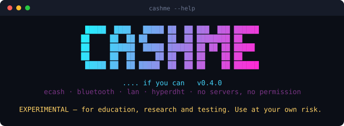
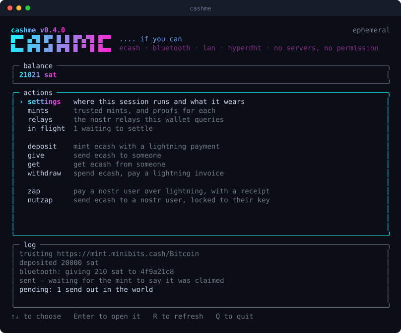
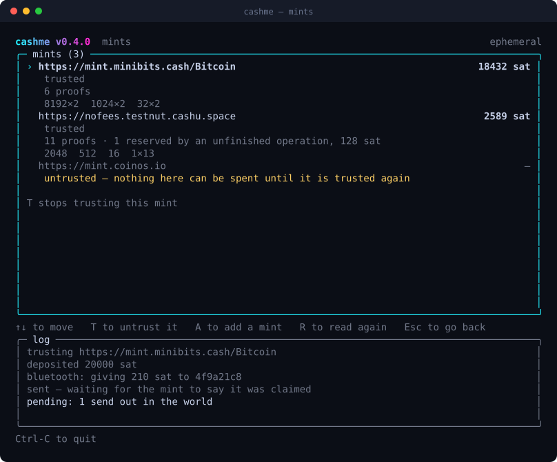
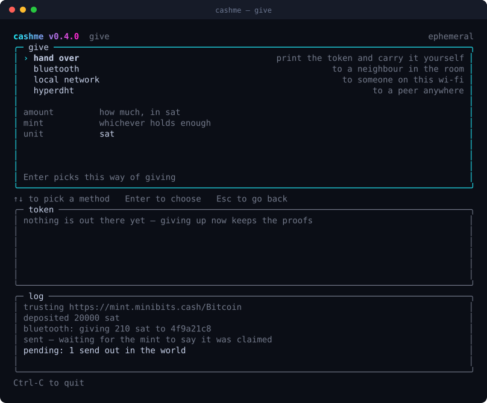

<p align="center">
  
</p>

<p align="center">
  <a href="https://github.com/mnaamani/cashme/actions/workflows/ci.yaml"></a>
  
  
  
</p>

<p align="center">
  <b>Bearer ecash, transfered peer-to-peer over the radio.</b><br>
  No account, no server in the middle, no permission asked.
</p>

<p align="center">
  <a href="#install">Install</a> ·
  <a href="#terminal-ui">The UI</a> ·
  <a href="#commandline-interface">Commands</a> ·
  <a href="#docs">Docs</a>
</p>

## Quickstart (Dev)

```sh
git clone https://github.com/mnaamani/cashme && cd cashme
npm install
npm start
```

## Install

From github releases:

```sh
curl -fsSL https://raw.githubusercontent.com/mnaamani/cashme/main/install.sh | sh
```

or over p2p network:

using `npm`:

```sh
npm install -g @cashme/cli
```

using `pear`:

```sh
npm -g i pear
pear install pear://tdnucsbcqeqer3yuyxduty4666zxr1f6ihua1j17g3pwr1qrnd9o
```

Open a new terminal, then:

```sh
cashme --version
cashme --help
```

The wallet keeps itself up to date in the background from its own pear link, so it never
needs reinstalling to move to a newer version. See [docs/installing.md](docs/installing.md)
for what each route does, pinning a version, and uninstalling.

---

## Terminal UI

Simply running `cashme` without any command opens a full-screen terminal UI.

<p align="center">
  
</p>

Every action is a row on that list. Two of them:

<table>
<tr>
<td width="50%"></td>
<td width="50%"></td>
</tr>
<tr>
<td align="center"><sub><b>mints</b> — who this wallet trusts, what each holds, and in which denominations</sub></td>
<td align="center"><sub><b>give</b> — hand it over by bluetooth, wi-fi, the hyperdht, or as text</sub></td>
</tr>
</table>

---

## Commandline interface

ecash tokens are exchanged directly between two devices over Bluetooth Low Energy (BLE),
the local network or the hyperdht, with no server in between — or handed over as text or a
QR code, for you to carry across whatever channel you trust.

```sh
cashme balance                                  # per mint and in total
cashme mints                                    # which mints this wallet trusts
cashme relays                                   # the nostr relays zap and nutzap ask
cashme deposit --amount 100 --mint https://...  # mint ecash by paying a lightning invoice
cashme withdraw --invoice lnbc...               # melt ecash back into lightning
cashme get                                      # wait for a neighbour to pay you
cashme give --public-key a1b2c3 --amount 21     # pay one, over bluetooth
cashme give --amount 21 --qr                    # or hand the token over yourself
cashme nutzap --pubkey npub1... --sats 21       # ecash to a nostr user (NIP-61)
cashme zap --pubkey npub1... --sats 21          # lightning zap with a receipt (NIP-57)
cashme pending                                  # sends still out in the world
cashme restore --mint https://...               # rebuild proofs the wallet lost
```

`--lan` and `--dht` swap the radio for the local network or the hyperdht; `--proxy` sends
everything http-shaped through a SOCKS5 or an HTTP proxy of your choosing.

Run `cashme <command> --help` for any command.

Every command in full is in [docs/usage/](docs/usage/).

---

## Docs

- [docs/usage/](docs/usage/) — every command, the global flags, where the traffic goes,
  and the wallet on disk
- [docs/building.md](docs/building.md) — building from source, and cutting and seeding a
  release
- [docs/development.md](docs/development.md) — running the repo, debug logging, the update
  architecture, the proxy packages, and the layout
- [docs/installing.md](docs/installing.md) — the three install routes, and which to use

## Licence

Apache-2.0. See [LICENSE](LICENSE) and [NOTICE](NOTICE).

A cashme binary has its whole dependency tree compiled into it, so the licenses of
everything in there travel with it, in
[THIRD-PARTY-NOTICES.md](THIRD-PARTY-NOTICES.md) — generated by `npm run notices` and
shipped in every release archive. A pear install gets only the binary, so the same
document is compiled into it and `cashme licenses` prints it. Nothing in the tree is
copyleft.

---

> ### ⚠ EXPERIMENTAL — use at your own risk
>
> cashme is made for educational, research and testing purposes only. Every mint is
> custodial, ecash is bearer money, and this is a young wallet. Keep balances small.
